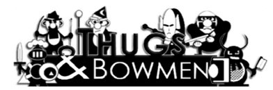

(This is a game that I wrote back in 2007 using the [TIGCC compiler](http://tigcc.ticalc.org/). You can download the executable from [ticalc.org archives](https://www.ticalc.org/archives/files/fileinfo/395/39505.html) or from this repository.)

Welcome to *Thugs & Bowmen*, a combinatorics guessing game in the same family as [Mastermind](http://en.wikipedia.org/wiki/Mastermind_(board_game)) and [Bulls and Cows](http://en.wikipedia.org/wiki/Bulls_and_cows) that is based on the rules of [*roshambo* (rock-paper-scissors)](http://en.wikipedia.org/wiki/Rock-paper-scissors). Players take turns aligning their pieces against hidden permutations of the opponent's pieces. The goal is to arrange one's pieces so that they defeat the opponent's pieces. After each attempt, the opponent tells the player how many victories and losses he or she has against the hidden permutation. Based on these clues, the player can rearrange his or her pieces and try again. The goal is to create a winning permutation in as few guesses as possible.

We can choose to play against another human or against the calculator.

## Installing

The game can be played on a TI-92 or TI-V200 graphic display calculator. Download the source repository and transfer the `tnb.9xz` or `tnb.v2z` file to your calculator. To play, enter `tnb()` on your calculator.

## Screenshots

Have fun!
